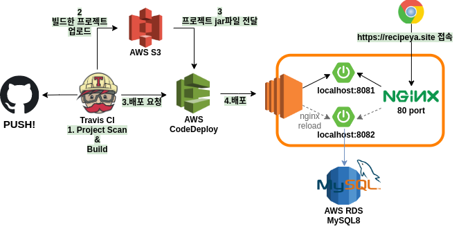
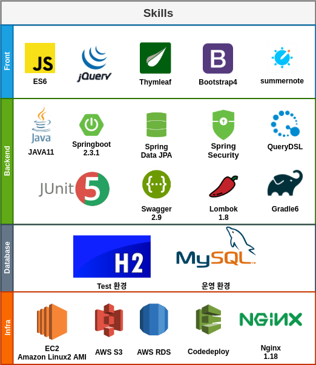
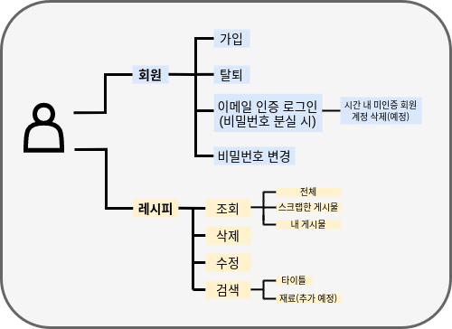

# _레시피야_ 

> 레시피야는 원하는 레시피를 검색할 수 있고, 자신만의 레시피를 등록해서 공유할 수 있는 웹 서비스입니다. 
> 
> [사이트 바로가기](http://recipeya.site)

----
1인 개발

### 프로젝트 구조

### 기술 스택

### 기술 선택 이유

**Spring이 아닌 Springboot를  선택한 이유**

기존 스프링을 사용하여 개발할 때는 여러 설정을 직접 해야 했습니다. 대표적으로 프로젝트를 생성할 때마다 `Component Scan`, `DispatcherServlet`, `DataSource`, `EntityManagerFactory` 같은 설정을 한 다음, WAS까지 연동해야 개발을 시작할 수 있었습니다.

Springboot는 위와 같은 문제를 해결합니다.

1. 내장 서버
2. Auto Configuration
3. starter로 의존성 쉬운 의존성 관리
4. jar파일로 쉬운 배포

Springboot를 사용하면서 `ComponentScan`을 지정하고, `ViewResolver`를 등록하고 프로젝트와 WAS를 연결하는 번거로운 일이 자동화되고 보다 더 개발에만 집중할 수 있는 환경을  얻을 수 있었습니다. 또한 `jar`로 빌드해서 쉬운 배포가 가능하기 때문에 스프링부트를 선택했습니다.

**JPA**

`JPA`는 러닝 커브가 있기 때문에 이미 몇 번 사용해 본 `MyBatis` 를 선택하면 더 빨리 개발을 진행할 수 있었습니다. 하지만 `MyBatis`를 사용할 때 몇 가지 단점을 있었습니다.

1. 중복되는 SQL
2. SQL을 평문으로 관리(오타 찾기 어려움)

이런 단점에도 불구하고 `MyBatis`는 훌륭한 도구라고 생각하지만,  직접 SQL을 관리하지 않고 `Querydsl`을 이용하여 Type Safe한 SQL을 작성할 수 있는 `JPA`의 특징. 무엇보다 간단한 CRUD쿼리는 물론이고 쿼리메서드와 같이 네이밍컨벤션을 이용하여 원하는 쿼리를 만들 수 있다는 점도 JPA를 선택한 이유 중 하나입니다. 처음엔 직접 SQL을 작성하는 것이 빠를 수 있어도 익숙해질수록 생산성이 훨씬 좋아질 것이라는 생각에 JPA를 선택했습니다.

**Spring Security**

`Login`,  `remember-me`, `PasswordEncoder`, `CSRF` 등 보안기능을 제공하기 때문에 선택이 아닌 필수였습니다.

**Swagger**

데이터를 등록/수정/삭제 REST API를 만들었기 때문에 API에 대한 문서가 필요했습니다. Swagger는 프로젝트 코드를 침범한다는 치명적인 단점이 있었지만 상용 프로젝트가 아니고, 적용 방법이 매우 간단하였기 때문에 Swagger를 사용하였습니다.

**Lombok**

`getter/setter`나 생성자, `Builder`를 만드는 등 기계적인 작업을 애노테이션으로 대체할 수 있기 때문에 채용하였습니다.

**JUnit5**

제가 사용한 스프링부트 2.3.1은 JUnit5를 기본으로 제공했습니다. JUnit이 가장 많이 쓰이고 있기 때문에 고민의 여지 없이 JUnit을 선택했습니다.

**TravisCI**

`Travis CI`는 전에 스프링부트 책을 공부하면서 한 번 써본 적이 있었습니다. `Jenkins` 같은 툴을 이용해보고 싶었지만 인프라에 대해서는 잘 몰랐기 때문에 한 번이라도 사용해봤던 `Travis CI`를 선택했습니다.

**Nignx**

CI/CD를 모두 적용해보는 것이 목표였기 때문에 무중단 배포를 위한 프록시 서버인 Nginx를 선택했습니다. Nginx역시 Travis CI와 마찬가지로 한 번 적용해본 경험이 있기 때문에 선택했습니다.

### 레시피야 기능

### 구현 영상

### 문제 해결 사례

[JPA @EntityGraph를 OnetoMany에 적용 시 페이징 처리 안 되는 이슈](https://coco-log.tistory.com/127?category=926746)

[JPA 연관관계를 가진 엔티티 save 하기](https://coco-log.tistory.com/128?category=926746)

[Security 현재 로그인한 사용자 정보 가져오기](https://coco-log.tistory.com/129?category=912572)

[Springboot + JPA + Querydsl로 좋아요 기능 만들기 1 - 등록](https://coco-log.tistory.com/133?category=912572)

[EC2(Amazon Linux2 AMI) Not enough space 에러 해결하기](https://coco-log.tistory.com/132?category=911481)

...